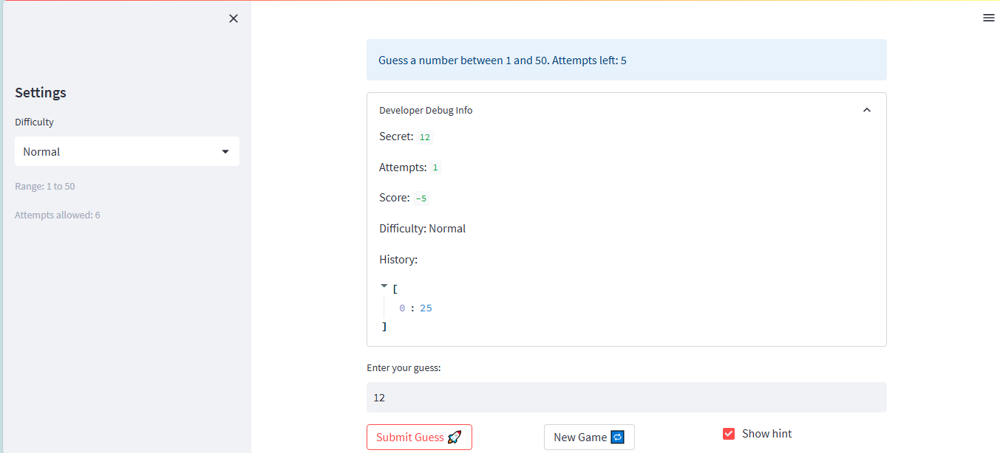

# 🎮 Game Glitch Investigator: The Impossible Guesser

## 🚨 The Situation

You asked an AI to build a simple "Number Guessing Game" using Streamlit.
It wrote the code, ran away, and now the game is unplayable. 

- You can't win.
- The hints lie to you.
- The secret number seems to have commitment issues.

## 🛠️ Setup

1. Install dependencies: `pip install -r requirements.txt`
2. Run the broken app: `python -m streamlit run app.py`

## 🕵️‍♂️ Your Mission

1. **Play the game.** Open the "Developer Debug Info" tab in the app to see the secret number. Try to win.
2. **Find the State Bug.** Why does the secret number change every time you click "Submit"? Ask ChatGPT: *"How do I keep a variable from resetting in Streamlit when I click a button?"*
3. **Fix the Logic.** The hints ("Higher/Lower") are wrong. Fix them.
4. **Refactor & Test.** - Move the logic into `logic_utils.py`.
   - Run `pytest` in your terminal.
   - Keep fixing until all tests pass!

## 📝 Document Your Experience

- [ ] Describe the game's purpose.
  - [ ] The purpose of the game is to create a guessing program that has 3 difficulties with varying ranges/number of attempts. A secret value is chosen randomly within the range and you need to guess the value within the number of attempts.
- [ ] Detail which bugs you found.
  - [ ] I found bugs in creating a new game after the old one is finished, the number of attempts and the range of these attempts per difficulty, and adding responses to unintended inputs.
- [ ] Explain what fixes you applied.
  - [ ] I added fixes to allow for the "New Game" button to work properly, the attempts/range for the difficulties to be there properly, and for the unintended inputs such as putting in a decimal to be treated appropriately.

## 📸 Demo

- 

## 🚀 Stretch Features

- [ ] [If you choose to complete Challenge 4, insert a screenshot of your Enhanced Game UI here]
